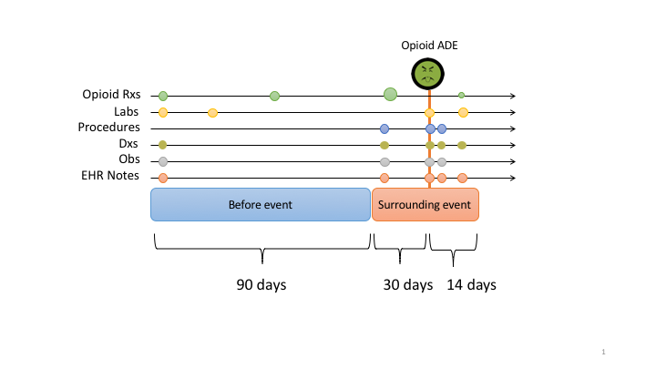

This repository contains code to accompany the paper:

 "Machine Learning for Phenotyping Opioid Overdose Events".

Please cite this paper if you use this code as part of a published research project.

## Overview

Generates features vectors for phenotyping models from electronic health record (EHR) data stored in OMOP CDM format.  Data surrounding each suspected opioid overdose event is gathered from two intervals and includes opioid prescriptions, labs, diagnoses, procedures, and observations.

## Requirements
* An electronic health record (EHR) database formatted and stored using the [OHDSI OMOP Common Data Model (CDM)](https://github.com/OHDSI/CommonDataModel) v5.2 or higher

* python >= 3.0 and the following packages:
    * numpy
    * pandas
    * from the python standard library
        * os, argparse, sqlite3, json, collections

## Repository files

`extract_OMOP_features.py` - extracts data from the OMOP CDM and outputs two files for continous and discrete features respectively.

`mme_OMOP.json` - a supporting json file containting a mapping of RxCUIs to Morphine Milligram Equivalent (MME) conversion factors

## Running the code

1.  The main script `extract_OMOP_features.py` must be supplied with an examples file in .csv format that contains person_ids for patients that have an opioid overdose diagnoses on their record and the dx_date where the diagnoses code first appears.
Headers should be included as 'person_id' and 'dx_date' respectively.  Dates are exptected to be in ISO 8601 format (YYYY-MM-DD). See `supporting_files/examples_sample.csv` for concrete examples.

2.  This work utilized sqlite as the backend database for storing OMOP CDM data.  When using something other than sqlite the code will need to be edited to import the appropraite python DB API and create a connection.  The SQL queries may also need slight adjustments based on differences in SQL syntax.

3. Run the script from the command line using:
`python script/extract_OMOP_features.py --db_path path/to/db --examples_path path/to/examples --model_name my_model`

The script will create two .csv files for discrete and continuous features in a new directory called `OMOP_features`.  Data for each person_id will appear in the same order as provided in the examples file.

## Questions/assistance
Please direct any questions/requests for assistance to badger.jonathan@marshfieldresearch.org

## License
This work is distributed under an MIT license.  Feel free to edit, copy, share.
